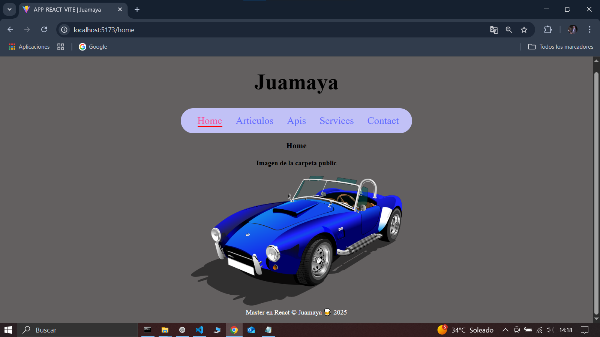

# App-React-Vite

## Crear App

>ABRE LA TERMINAL  cmd  EN LA CARPETA DEL PROYECTO

``` 
E:\E_2025\PROYECTOS REACT\app-react-vite> npm create vite@latest app
E:\E_2025\PROYECTOS REACT\app-react-vite> cd app
E:\E_2025\PROYECTOS REACT\app-react-vite\app> npm install
E:\E_2025\PROYECTOS REACT\app-react-vite\app> code . --> ABRE VS Code

``` 


>ABRE LA TERMINAL Git Bash  EN VS Code

>INSTALAR react-router-dom

>RUN APP
```l
marin@PC-SALON-JUAN MINGW64 /e/E_2025/PROYECTOS REACT/app-react-vite/app
$ npm install react-router-dom

marin@PC-SALON-JUAN MINGW64 /e/E_2025/PROYECTOS REACT/app-react-vite/app
$ npm run dev

```


---

# Archivos de Codigos de la APP-REACT-VITE 


## index.html

```html

<!doctype html>
<html lang="en">
  <head>
    <meta charset="UTF-8" />
    <link rel="icon" type="image/svg+xml" href="/vite.svg" />
    <meta name="viewport" content="width=device-width, initial-scale=1.0" />
    <title>APP-REACT-VITE | Juamaya</title>
  </head>
  <body>
    <div id="root"></div>
    <script type="module" src="/src/main.jsx"></script>
  </body>
</html>

 
```


## main.jsx

```jsx
import { StrictMode } from "react";
import { createRoot } from "react-dom/client";
import "./index.css";
import App from "./App.jsx";

createRoot(document.getElementById("root")).render(
  <StrictMode>
    <App />
  </StrictMode>
);
```

## App.jsx

```jsx
import { Rutas } from "./routes/Rutas";
import "./App.css";

function App() {
  return (
    <>
      <Rutas />
    </>
  );
}

export default App;
```

---

# Componentes Layout

## Rutas.jsx

```jsx
import { Routes, Route, BrowserRouter, Navigate } from "react-router-dom";
import Footer from "../components/layout/Footer";
import Header from "../components/layout/Header";
import Navbar from "../components/layout/Navbar";

import Home from "../components/pages/Home";
import Articulos from "../components/pages/Articulos";
import Apis from "../components/pages/Apis";
import Services from "../components/pages/Services";
import Contact from "../components/pages/Contact";

export const Rutas = () => {
  return (
    <BrowserRouter>
      {/*layout*/}
      <Header />
      <Navbar />
      {/*Contenido centrl y rutas*/}
      <section id="content " className="content">
        <Routes>
          <Route path="/" element={<Home />} />
          <Route path="/home" element={<Home />} />
          <Route path="/articulos" element={<Articulos />} />
          <Route path="/apis" element={<Apis />} />
          <Route path="/services" element={<Services />} />
          <Route path="/contact" element={<Contact />} />
        </Routes>
      </section>

      <Footer />
    </BrowserRouter>
  );
};
```

## Header.jsx

```jsx
const Header = () => {
  return (
    <header className="header">
      <h1>Juamaya</h1>
    </header>
  );
};

export default Header;
```

## Navbar.jsx

```jsx
import { NavLink } from "react-router-dom"

const Navbar = () => {
  return (
    <nav className='nav'>
      <ul>
        <li><NavLink to="/home"className={({ isActive }) => isActive ? 'active' : undefined} > Home </NavLink></li>
        <li><NavLink to="/articulos">Articulos</NavLink></li>
        <li><NavLink to="/apis">Apis </NavLink></li>
        <li><NavLink to="/services">Services </NavLink></li>
        <li><NavLink to="/contact">Contact</NavLink></li>
      </ul>
    </nav>
  )
}

export default Navbar
```

## Footer.jsx

```jsx
const Footer = () => {
  return (
    <footer className="footer">Master en React &copy; Juamaya 🍺 2025</footer>
  );
};

export default Footer;
```

# Paginas

## Home.jsx

```jsx
const Home = () => {
  return (
    <div>
      <h3>Home</h3>
      <h4>Imagen de la carpeta public</h4>
      </img>
    </div>
  )
}

export default Home
```

## Articulos.jsx

```jsx
const Articulos = () => {
  return <div>Articulos</div>;
};

export default Articulos;
```
## Apis.jsx

```jsx

const Apis = () => {
  return (
    <div>Apis</div>
  )
}

export default Apis
```
## Services.jsx

```jsx
const Services = () => {
  return (
    <div>Services</div>
  )
}

export default Services
```
## Contact.jsx

```jsx
import MiImagen from '../../assets/Fire.png';

const Contact = () => {
  return (
    <>
      <h3>Contact</h3>
      <h4>Imagen importada  de la carpeta assets</h4>
      
    </>
  )
}

export default Contact
```
---

# Estilos CSS

## index.css

```css
body {
  background-color: #636060;
  margin: 0;
  display: flex;

  min-width: 320px;
  min-height: 100vh;
}

h1 {
  font-size: 3.2em;
  line-height: 1.1;
}
```

## App.css

```css
#root {
  margin: 0 auto;
  padding: 1rem;
  text-align: center;
}
.nav {
  display: flex;
  background-color: #c1c1f6;
  border-radius: 2rem;
}
ul {
  display: flex;
  flex-direction: row;
}
li {
  margin-right: 2rem;
  list-style: none;
}
a {
  font-weight: 500;
  color: #646cff;
  text-decoration: inherit;
  font-size: 1.5rem;
}
a:hover {
  color: #f253a2;
}

a.active {
  color: red;
  border-bottom: 2px solid red;
}

.footer {
  color: #fff;
}
```
